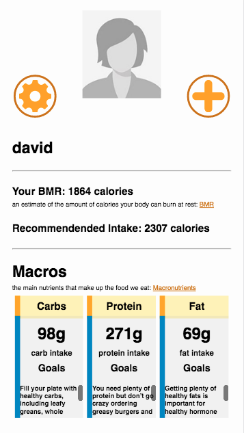
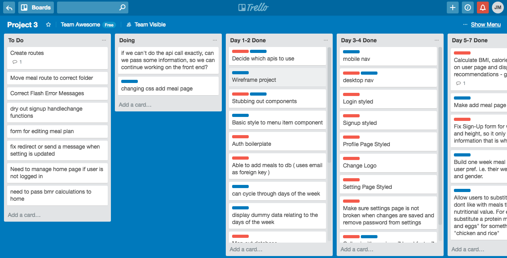

#Chomper

Make a meal plan for a week with a few clicks.  Discover your recommended macronutrient levels, by entering in your personal information.

## Technical Requirements

* Build a full-stack application by making your own backend and your own front-end
Have an interactive front-end, preferably using a modern front-end framework
* Be a complete product, which most likely means multiple relationships and CRUD functionality for at least a couple models. However, this is ultimately up to your discretion.
* Use a database, whether that's one we've covered in class or one you want to learn
* Implement thoughtful user stories that are significant enough to help you know which features to build and which to scrap
* Have a visually impressive design to kick your portfolio up a notch and have something to wow future clients & employers
* Be deployed online so it's publicly accessible

## Approach Taken

* Researched MongoDB and React Lifecycle Methods
* Created a Trello Board for tasks to complete
* Began with auth boilerplate
* Stubbed out coponents
* Added and tested routes
* Created user and meal databases
* Added routes to create, read, update, and destroy individual meals
* Created a swipe functionality to display a week worth of meals
* Groomed edamam API to return a list of 7 breakfasts, lunches, and dinners
* Display a list of weekly meals
* Researched BMR and macronutrients
* Created tables to display user BMR, macronutrients, and heart rate
* Refined design
* Deployed to Heroku

## Built With

* [Mongo](https://www.mongodb.com) - NoSQL database
* [Express](https://expressjs.com/) - Routing
* [React](https://reactjs.org/) - Components, Links
* [Node](https://nodejs.org/en/) - bcrypt, body-parser, mongoose, morgan, axios
* [Edamam](https://developer.edamam.com/) - recipe and nutrient API
* [material.io](https://material.io/color/#!/?view.left=0&view.right=0&primary.color=64B5F6&secondary.color=FFA000&secondary.text.color=EEEEEE&primary.text.color=424242) - color tool
* [flaticon](https://www.flaticon.com/free-icon/settings-work-tool_70367) - carrot, settings, and plus icon

## Referenced

* [Global Diabetes Community](https://www.diabetes.co.uk/bmr-calculator.html) - BMR formulas
* [Healthy Eater](https://healthyeater.com/how-to-calculate-your-macros) - Macronutrients' formulas

## Unsolved Problems

* Dry up handlechange functions
* Manage homepage if user is not logged in
* Settings seem to not update the first attempt

## Interesting Notes

* New meal plans are generated each week
* The user can generate a meal plan from their profile page
* The user can adjust their settings as they lose or gain weight to see their individual macronutrient suggestions

## Next Steps

* Create meal plans based on user preferences
* Meal should be displayed on calendar until the amount of servings are out

## Authors

* **Tai Bayard** - *API management, styling, database handling, BLUE* - [taibayard](https://github.com/taibayard)
* **Justin Mitchell** - *database management, user information, route handling, RED* - [JustinPMitchell](https://github.com/JustinPMitchell)

## Acknowledgments

* Special Thanks to Jordan Krissi and Austin Schiebel
* Inspiration came from MyFitnessPal
* [Lachlan Arthur](http://jsfiddle.net/lachlan/YcVEA/) - Canvas Electrocardiogram